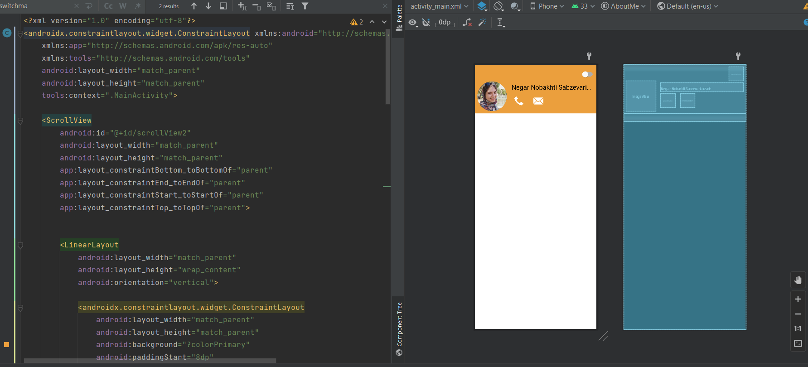
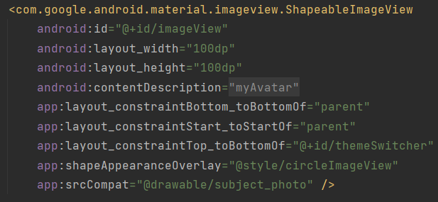
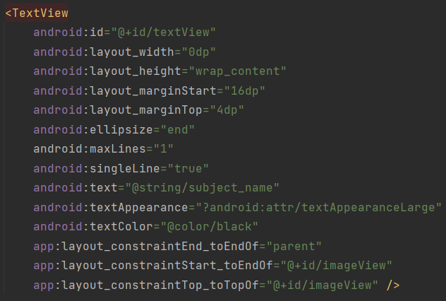
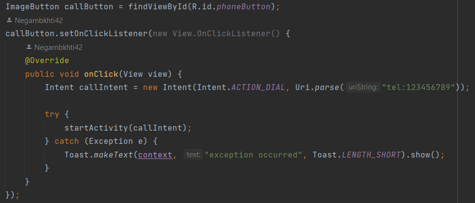
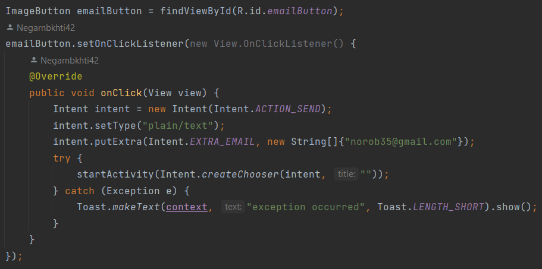
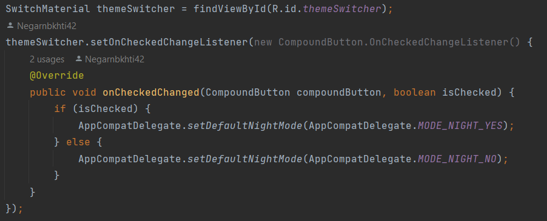

# About me

This simple android app was made as the first homework of mobile programming course on spring of 1401 semester at Sharif university of technology.

## About

### Layout

The first step to building this proram was of course, to setup the basic UI. The entirety of the view is placed in a `scrollview` (besides the `constraintLayout` parent) so that the page would be scrollable. Inside that `scrollView` is placed a `linearLayout` to contain the different parts. The head containing the profile and title are placed in a `constraintLayout` and textview is placed after that.

For shaping the profile picture to circle, material's `shapeableImageView` is used instead of the default `imageView`. this way the border shape of picture can be changed by setting a style.

Long titles are also ellipsized using the `maxLines` and `ellipsis` attributes.

### Event listeners

There are three main actions user can perform in this app. Calling the owner, emailing the owner, changing the theme. the former two are explained and the latter will be further expained in the documnt.

For calling the owner we use the `ACTION_DIAL` intent of android API. The phonenumber is passed to the intent as data. The intent is then started.

Sending an email pretty much follows the same pattern. for this intent, the intent `ACTION_SEND` is used. As an extra step, the type of the data is set to "plain\text" and the receiver's email is set as an extra.

### Changing theme

The tool used for changing the theme is `MaterialSwitch`. The event listener for this view looks after changes and sets app's default theme to light or dark based on the selection of the switch. suitable colors are also defined and set in the dark and light theme XML files.

